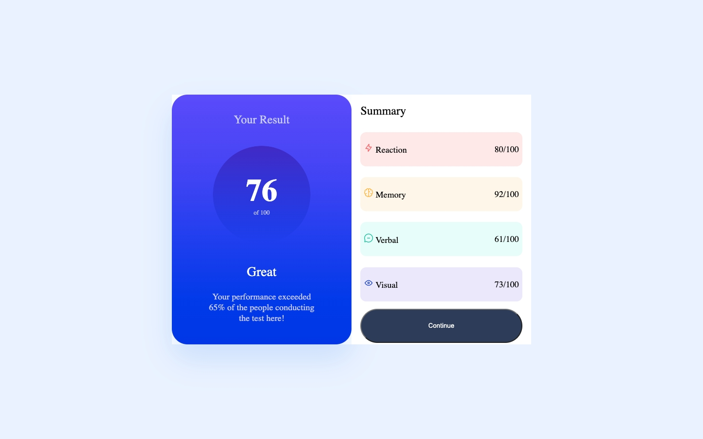

# Frontend Mentor - Results summary component solution

This is a solution to the [Results summary component challenge on Frontend Mentor](https://www.frontendmentor.io/challenges/results-summary-component-CE_K6s0maV). Frontend Mentor challenges help you improve your coding skills by building realistic projects.

## Table of contents

- [Overview](#overview)
  - [Screenshot](#screenshot)
  - [Links](#links)
  - [Built with](#built-with)
  - [What I learned](#what-i-learned)
  - [Continued development](#continued-development)
  - [Useful resources](#useful-resources)
- [Author](#author)

## Overview

An HTML and CSS Results Summary Component

### Screenshot

### Links

- Solution URL: https://www.frontendmentor.io/solutions/css-gradients-flexbox-a2hKCWTai5
- Live Site URL: https://results-summary-component-ebon-xi.vercel.app/
- GitHub Repo: https://github.com/ZounMedia/results-summary-component

## My process

### Built with

- Semantic HTML5 markup
- CSS custom properties
- Flexbox
- Mobile-first workflow

### What I learned

I learned a lot about linear gradients and how to use them.

### Continued development

I would like to focus on my project setup for future projects. Regular css is ok for small projects like this one, but I will use SASS for larger HTML/CSS projects.

### Useful resources

- https://www.joshwcomeau.com/gradient-generator/ - CSS Gradients Generator

## Author

- Frontend Mentor - https://www.frontendmentor.io/profile/@rzounlom
